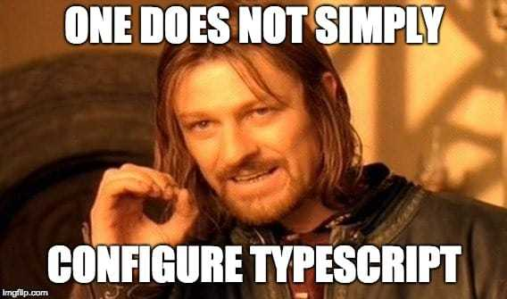
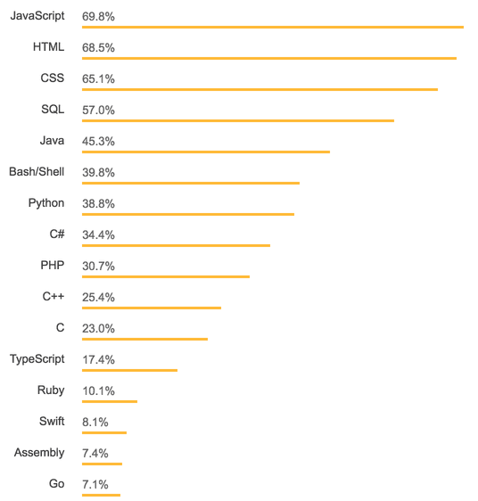

# Typescript и Babel: "Счастливы Вместе"

Перевод статьи [Matt Turnbull](https://iamturns.com/about/) [TypeScript With Babel: A Beautiful Marriage](https://iamturns.com/typescript-babel/)

Использовать TypeScript еще никогда не было так просто: благодаря TypeScript плагину для Babel (`@babel/preset-typescript`), который стал результатом длительного сотрудничества между командами TypeScript и Babel. В этой статье мы узнаем 4 причины, почему TypeScript и Babel идеальная пара, и пройдем пошаговое руководство на TypeScript за 10 минут.

## А? Что? Зачем?

Сначала, я не понимал необходимость использования новых настроек Babel.

Разве Babel и TypeScript не абсолютно разные вещи? Как Babel осуществляет проверку типов TypeScript? TypeScript уже может производить JS код стандарта ES5 также как и Babel, так в чем идея? Похоже обЪединение Babel и TypeScript только все усложняет?

После нескольких часов изучения проблемы, мое заключение:
TypeScript и Babel - это счастливый союз.

И вот почему:

1) Вы уже используете Babel (или должны).
Вы принадлежите одной из 3-х категорий:

Вы уже используете Babel. Может быть неявно, например, когда Webpack настроен на то, чтобы "скормить" `*.js` файлы Babel (это случай большинства boilerplates, включая create-react-app).

Вы используете Typescript без Babel. Подумайте над тем, чтобы добавить Babel в свой арсенал, он предоставляет множество уникальных возможностей. Читайте далее.

Не используете Babel? Самое время начать.
Пишите на современном JavaScript без страха сломать что-либо.
Ваш JavaScript код должен запускаться в старом браузере? Без проблем, Babel транспилирует код так, чтобы все было okay. Без сомнений используйте последние возможности языка.

У компилятора TypeScript есть похожая фича, которая включается, если поставить преобразование к стнадартам типа ES5 или ES6. 

Но, конфигурация Babel делает это лучше с применением `babel-preset-env`. Вместо привязки к возможностям спецификаций JavaScript (ES5, ES6, и т.д.), вы просто перечисляете окружения, которые вам необходимо поддерживать:

```json
"targets": {
	"browsers": ["last 2 versions", "safari >= 7"],
	"node": "6.10"
}
```

Babel использует `compat-table` для проверки тех возможностей JavaScript, которые нуждаются в преобразовании и использовании полифилов в том окружении, которое настроено.
compat-tablecompat-table
Нужно воздать должное, тому кто назвал этот проект `compat-table`.

Интересная техника, которая используется в `create-react-app`: при разработке компилируем для последних версий браузеров (для быстроты), а на продакшене компилируем с поддержкой наибольшего числа браузеров (для совместимости). Отлично.

### Babel супер гибкий в настройках.
Нужен JSX? Flow? TypeScript? Просто установите плагин и Babel обо всем позаботится. Есть огромный выбор официальных плагинов, которые позволяют поддерживать появляющиеся возможности JavaScript. 

А также есть множество сторонних плаигнов: улучшение импортов lodash, расширение возможностей `console.log`, или разделение `console.log`. Можно много чего найти в списке плагинов awesome-babel.

Но, будьте осторожны. Если плагин значительно меняет синтаксис, TypeScript может оказаться не в состоянии распарсить его. Например, высоко ожидаемый оператор опциональной последовательности ( для безопасного обращения к цепочкам свойств или методов объекта `user?.email`) имеет свой плагин Babel:`@babel/plugin-proposal-optional-chaining`

Но, к сожалению, TypeScript не умеет распознавать этот обновленный синтакс.

Без паники, у нас есть альтернатива…

### Babel Macros
Знаете кто такой Kent C Dodds? Он создал революционный плагин Babel: `babel-plugin-macros`.

Вместо добавления плагинов в файл конфигурации Babel, вы устанавливаете макрос как зависимость и импортируете его в своем коде. Макрос включается при компиляции Babel, и меняет код как будет нужно.

Вот например. Используем `idx.macro` чтобы устранить нашу боль, пока не пояится официальная поддержка оператора опциональной последовательности.

```javascript
import idx from 'idx.macro';

const friends = idx(
	props,
	_ => _.user.friends[0].friends
);
```

Компилируется в:

```javascript
const friends =
	props.user == null ? props.user :
	props.user.friends == null ? props.user.friends :
	props.user.friends[0] == null ? props.user.friends[0] :
	props.user.friends[0].friends
```

Макросы довольно новые, но их поддержка быстро растет. Особенно после появления в  `create-react-app v2.0`. 

CSS in JS поддерживаются: `styled-jsx`, `styled-components`, и `emotion`. 

Webpack плагины: `raw-loader`, `url-loader`, и `filesize-loader`. И остальные в списке `awesome-babel-macros`.

И вот, что самое лучшее: в отличие от плагинов Babel, все макросы Babel совместимы с TypeScript. 

Еще они помогают: уменьшить число зависимостей, избежать вычислений на стороне клиента, и выявить ошибки на стадии сборки. Подробнее об этом можно почитать здесь.

2) Всегда проще использовать ОДИН компилятор.
TypeScript требует использования собственного компилятора — взамен он дает нам суперспособность проверки типов.

## Смутные времена (до Babel 7).

Объединить два разных компилятора (TypeScript и Babel) - задача не из легких. Последовательность компиляции была такой: TS > TS Compiler > JS > Babel > JS (снова).

Webpack часто использовался для решения этой проблемы. 

Настариваем Webpack конфиг чтобы скормить файлы  `*.ts` TypeScript, а результат затем передать Babel. 

Но какой TypeScript loader вы используете? 

Два популярных варианта: `ts-loader` и `awesome-typescript-loader`. `README.md`  `awesome-typescript-loader` упоминает о том, что он может быть медленным при определенной нагрузке, и рекоммендует `ts-loader` с `HappyPack` или `thread-loader`. `README.md` для `ts-loader` рекомендует сочетание с `fork-ts-checker-webpack-plugin`, `HappyPack`, `thread-loader`, и / или `cache-loader`.

Да хорош. Стоп. Здесь большинство людей накрывет и они откладывают TypeScript в ящик “слишком сложно”. И я их не виню.



## Светлое настоящее (с Babel 7).

Разве не здорово иметь один JavaScript компилятор? Не важно, что используется в вашем коде: воможности ES2015, JSX, TypeScript, или вообще что-нибудь экзотическое  — компилятор знает, что делать.

Я только что описал Babel. Съели?

Позволяя Babel работать как единственному компилятору, нет необходимости настраивать, или объединять два компилятора в какой-то запутанной магии Webpack.

Это также упрощает всю JavaScript экосистему. Вместо линтеров, систем тестирования, сборщиков, и бойлерплейтов, поддерживающих разные компиляторы, им всего лишь нужно поддерживать Babel. Вы конфигурируете Babel для поддержки того, что необходимо. Скажите "пока" `ts-node`, `ts-jest`, `ts-karma`, `create-react-app-typescript`, и т.п., и используйте вместо этого поддержку Babel. Поддержка Babel есть везде и всюду, посмотрите на страницу установки Babel:

3) Быстрее компилируется.

Внимание! Вам лучше присесть.
Как Babel поддерживает TypeScript код? Он его удаляет.

Да, он вырезает весь TypeScript, преобразует его в "обычный" JavaScript, и идет дальше своей дорогой.

Звучит нелепо, но у этого метода есть два мощных преимущества.

Первое: ️⚡️ ЭТО МОЛНИЕНОСНО! ⚡️.

Большинство разработчиков Typescript сталкиваются с медленно компиляцией в режиме разработки / наблюдения. Вы покодили, сохранили файл, и… затем… вот сейчас… почти… все, вы можете увидеть ваши изменения. Упс, сделали опечатку, исправляем, сохраняем, иии… эх. Это достаточно меденно, что надоедает и убивает весь энтузиазм.

Сложно винить компилятор TypeScript, он выполняет много работы. Сканирует файлы на определение типов (`*.d.ts`), включая `node_modules`, и убеждается что весь ваш код использует их корректно. Вот почему многие выделяют проверку типов Typescript в отдельный процесс. 

Тем не менее,сочетаие Babel + TypeScript поддерживает более быструю компиляцию благодаря превосходному кэшированию Babel и архитектуре пофайловой обработки.

Итак, если Babel выпиливает весь TypeScript код, какой смысл писать на TypeScript? Это приводит нас ко второму преимуществу…

4) Проверка на ошибки типов только когда вы готовы.

Допустим вы поэксперементировали с кодом, быстренько запилили решение, чтобы посмотреть сработает ли ваша идея. Вы сохраняете файл, и TypeScript орет на вас:

“НЕТ! Я не собираюсь это компилировать! Твой код поломался в 42 разных файлах!”

Естественно, вы знаете, что все сломалось. Возможно вы также поломали парочку юнит тестов. 

Но, вы просто эксперементировали, на данный момент. Это становится невыносимым - постоянно убеждаться в том что весь твой код работает безопасно.

В этом второе преимущество Babel выпиливания кода TypeScript при компиляции. Вы пишете код, сохраняете, и он компилируется (очень быстро), без проверки на безопаснось типов. 

Продолжайте экспериментировать с вашим решением до тех пор, пока не будете готовы проверить код на ошибки. 

Такой рабочий процесс не тревожит вас, пока вы кодите.

Тогда  как запустить проверку на ошибки по типам? Добавьте скрипт `npm run check-types`, который вызовет компилятор TypeScript. Я настроил скрипт для запуска тестирования `npm test` чтобы сначала проверить типы, а затем продолжить запуск юнит-тестов.

Это неидеальный союз.

Есть четыре возможности TypeScript которые не компилируются в Babel из-за архитектуры пофайловой обработки.

Не волнуйтесь в этом нет ничего страшного. И TypeScript предупредит вас об этих проблемах если флаг `isolatedModules` включен.
1) Пространства имен.

Решение: не используйте их! Они устарели. Вместо них используйте стандартные ES6 модули (import / export). Правило линтера `tslint` поможет убедиться,что они не используются.
2) Кастуем типы с применением синтаксиса `<newtype>x`.

Решение: Используйте `x as newtype`.

3) Константные перечисления.

Стыд и позор. Пока придется использовать обычные перечисления.

4) Устаревший синтаксис import / export.

Например: 
```javascript
import foo = require(...); 
export = foo;

```

За все годы программирования на TypeScript не встречал такого. Кто пишет такой код? Заканчивайте!

Ok, я готов использовать TypeScript с Babel!


Давайте сделаем это! Вошли и вышли. Простое приключение на 10 минут.

Я предполагаю, что увас уже установлен Babel 7. Если нет, почитайте Babel Migration Guide.
1. Переименуем `.js` файлы в `.ts`

Если предположить что ваши исходники лежат в каталоге `/src`:

```bash
find src -name "*.js" -exec sh -c 'mv "$0" "${0%.js}.ts"' {} ;
```

2. Добавьте TypeScript к Babel

Несколько зависимостей:

``` bash
npm install --save-dev @babel/preset-typescript @babel/plugin-proposal-class-properties @babel/plugin-proposal-object-rest-spread
```

В файле конфигурации Babel (`.babelrc` или `babel.config.js`):

```json
{
	"presets": [
			"@babel/typescript"
	],
	"plugins": [
			"@babel/proposal-class-properties",
			"@babel/proposal-object-rest-spread"
	]
}
```

В TypeScript есть пара возможностей, о которых Babel следует знать ( с помощью тех плагинов, что мы упоминали выше).

Babel по умолчанию следит за `.js` файлами, и, к сожалению, это не определяется внутри файла конфигурации Babel.

Если вы используете `Babel CLI`, добавьте флаг `--extensions '.ts'`

Если вы используете Webpack, добавьте `'ts'` к массиву `resolve.extensions`.
3) Добавьте проверку типов `check-types`

В `package.json`:

```json
"scripts": {
	"check-types": "tsc"
}
```

Эта команда просто вызовет компилятор TypeScript (`tsc`).
Откуда она возьмет `tsc`? Нам нужно установить TypeScript:

```bash
npm install --save-dev typescript
```

Для настройки TypeScript (и tsc), нам нужен файл `tsconfig.json` в корневой директории:

```json
{
	"compilerOptions": {
		// Target latest version of ECMAScript.
		"target": "esnext",
		// Search under node_modules for non-relative imports.
		"moduleResolution": "node",
		// Process & infer types from .js files.
		"allowJs": true,
		// Don't emit; allow Babel to transform files.
		"noEmit": true,
		// Enable strictest settings like strictNullChecks & noImplicitAny.
		"strict": true,
		// Disallow features that require cross-file information for emit.
		"isolatedModules": true,
		// Import non-ES modules as default imports.
		"esModuleInterop": true
	},
	"include": [
		"src"
	]
}
```
Готово.

Итак, установка завершена. 

Теперь запустите `npm run check-types` (режим наблюдения: `npm run check-types -- --watch`) и убедитесь, что TypeScript в восторге от вашего кода. 

Скорее всего вы сможете найти пару багов, о которых вы не подозревали. Это хорошая новость! Вам поможет The Migrating from Javascript guide.

Гайд Microsoft TypeScript-Babel-Starter содержит дополнительные инструкции по установке, включая установку  Babel с нуля, генерацию типов файлов (`d.ts`), и использование их с React.

Что насчет линтеров?

Используйте tslint.

Обновление (Февраль 2019): Используйте ESlint! 

Команда TypeScript сфокусировалась на интеграции с ESLint с января. 

Настроить ESLint довольно легко благодаря `@typesript-eslint`. 

Для вдохновления, зацените мой мегаконфиг ESLint который включает в себя TypeScript, Airbnb, Prettier, и React.

Babel + TypeScript = Счастливы вместе.

Babel единственный JavaScript компилятор, который вам необходим. Он конфигурируется для поддержки всего, что необходимо.

Нет необходимости битвы между двумя соревнующимися компиляторами JavaScript. Упростите настройку вашего проекта и воспользуйтесь преимуществами интеграций Babel с линтерами, тестами, сборщиками, и бойлерплейтами.

Сочетание Babel и TypeScript молниеносно быстро компилируется, и позволяет вам оставаться в зоне кодинга, осуществляя проверку типов только когда вы будете готовы.

Вангую: TypeScript будет расти.

Согласно последенему исследованию Stack Overflow Developer Survey, JavaScript самый популярный язык, с TypeScript на #12 позиции. Это большое достижение TypeScript, обогнать такие языки как Ruby, Swift, и Go.



Вангую что TypeScript в следующем году ворвется в топ 10.

Команда TypeScript усердно работает чтобы их продукт любили. Эта интеграция с Babel preset стала результатом годового сотрудничества между командами, и теперь они сфокусировались на интеграции с ESLint. 

Это довольно умно — задействовать возможности, сообщество и плагины существующих инструментов. Разработка конкурирующих компиляторов и линтеров - напрсная трата усилий.

Путь к TypeScript вымощен простыми настройками наших любимых инструментов. Препятствия для входа становятся все незаметнее.

С ростом популярности VS Code, разработчики уже имеют среду для написания кода на TypeScript. Автокомплит на стероидах вызывает слезы радости.

Также теперь есть поддержка в `create-react-app v2.0`, предоставляя TypeScript аудиторию с 200k загрузками в месяц.

Если вы отложили TypeScript, потому что его сложно настроить, у вас больше нет оправданий. Пришло время выйти из сумрака.
